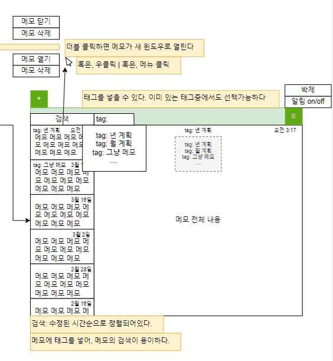

---

# 계획 관리 및 메모 프로그램 :speech_balloon:
#
### 팀명: 조아
###### 팀원: (팀장)천현준, 문성준, 이지아, 윤하겸, 정성민

---

# 어떤 걸 만드나요?
계획 관리 및 메모 프로그램

---

# 왜 "계획 관리 및 메모 프로그램" 을 만드나요?
- 스티커 메모장에서 여러 메모를 띄우고 싶을 때, 화면을 너무 차지했다.
- 계획을 관리하고 기록하는 모바일 앱은 많지만, 데스크탑 앱은 거의 없다.
- 또한, 그런 대부분의 프로그램은 전문화 되어있어서, 일반 사용자가 사용하기에 적합하지 않다.

---

# 일렉트론(Electron)이란?
- 오픈소스 브라우저 Chromium과 Node.js를 기반으로 하는 웹 기술인 HTML, CSS, JavaScript를 사용하여 디자인하고, Node.js로 백엔드를 구성할 수 있음.
- Window, Mac OS, Linux의 크로스 플랫폼을 지원함으로, 하나의 소스코드로 여러 운영체제를 지원할 수 있다.
- JavaScript 하나의 프로그래밍 언어만으로 프론트와 백엔드를 동시 개발 가능하다.

---

# 결정한 이유
- 지속적으로 업데이트 되고 있다.
- Github/Electron 저장소의 그래프를 통해 지난 한 달간, Main 브랜치에 60개의 커밋이 이뤄지며, 많은 이슈들이 해결되고 있음을 볼 수 있다.
- 개발 문서가 잘 정리되어 있다.
- 이미 Electron으로 개발된 수 많은 애플리케이션으로 기술이 증명되었다.- Visual Studio Code, Slack, Atom, Skype, Github Desktop, Figma 등 많은 인지도있는 애플리케이션들이 해당 기술로 개발되어 신뢰할 수 있는 기술임이 증명되었다.
- 3학년에 웹 프로그래밍 과목을 수강하여, 웹 기술에 익숙해져 있는 상태에서, 다른 언어나 기술 공부에 시간을 최대한 할애하지 않음으로서, 학습 시간을 획기적으로 줄이고, 개발에 시간을 더욱 투자하기 위해 선택하였다.

---

지속적_업데이트.PNG)

---

개발_문서.PNG)

---

# 어떻게 협업 하나요?
- Github의 Pull requests
- Pull requests의 장점- 코드 리뷰를 할 수 있다.
- 코드 리뷰를 함으로서, 파일의 어떤 내용이 변경되는지 확인하고, 소스코드를 개선하여 잘 정리되고, 문제가 없는 코드만을 최대한 Main 브랜치에 병합(Merge) 하도록 할 수 있다.
- 소스코드가 어떻게 변경되어왔는지, 누가 변경했는지 확인하기 간편하다.

---

의_장점.PNG)

---

# 진행 계획 변경
<table>
  <tr>
    <th Rowspan=2>주요 내용</th>
    <th Colspan=8>추진 일정</th>
    <th Rowspan=2>소요 기간</th>
  </tr>
  <tr>
    <td Colspan=2>3</td>
    <td Colspan=2>4</td>
    <td Colspan=2>5</td>
    <td Colspan=2>6</td>
  </tr>
  <tr>
    <td>브레인 스토밍</td>
    <td style="background: #C6D9F1; width: 30px"></td>
    <td></td>
    <td></td>
    <td></td>
    <td></td>
    <td></td>
    <td></td>
    <td></td>
    <td>2주</td>
  </tr>
  <tr>
    <td>레이아웃과 기능 설계 및 역할분담</td>
    <td></td>
    <td style="background: #C6D9F1; width: 30px"></td>
    <td></td>
    <td></td>
    <td></td>
    <td></td>
    <td></td>
    <td></td>
    <td>2주</td>
  </tr>
    <tr>
    <td>기초 기능 개발</td>
    <td></td>
    <td></td>
    <td style="background: #C6D9F1; width: 30px"></td>
    <td style="background: #C6D9F1; width: 30px"></td>
    <td></td>
    <td></td>
    <td></td>
    <td></td>
    <td>2개월</td>
  </tr>
    <tr>
    <td>로그인과 서버 통신</td>
    <td></td>
    <td></td>
    <td></td>
    <td></td>
    <td style="background: #C6D9F1; width: 30px"></td>
    <td></td>
    <td></td>
    <td></td>
    <td>2주</td>
  </tr>
    </tr>
    <tr>
    <td>서버에 데이터 저장</td>
    <td></td>
    <td></td>
    <td></td>
    <td></td>
    <td></td>
    <td style="background: #C6D9F1; width: 30px"></td>
    <td style="width: 30px"></td>
    <td style="width: 30px"></td>
    <td>2주</td>
  </tr>
</table>

---

# 진행 계획 변경
<table>
  <tr>
    <th Rowspan=2>주요 내용</th>
    <th Colspan=8>추진 일정</th>
    <th Rowspan=2>소요 기간</th>
  </tr>
  <tr>
    <td Colspan=2>3</td>
    <td Colspan=2>4</td>
    <td Colspan=2>5</td>
    <td Colspan=2>6</td>
  </tr>
  <tr>
    <td>브레인 스토밍</td>
    <td style="background: #C6D9F1; width: 30px"></td>
    <td></td>
    <td></td>
    <td></td>
    <td></td>
    <td></td>
    <td></td>
    <td></td>
    <td>2주</td>
  </tr>
  <tr>
    <td>레이아웃과 기능 설계 및 역할분담</td>
    <td></td>
    <td style="background: #C6D9F1; width: 30px"></td>
    <td></td>
    <td></td>
    <td></td>
    <td></td>
    <td></td>
    <td></td>
    <td>2주</td>
  </tr>
    <tr>
    <td>기초 기능 개발</td>
    <td></td>
    <td></td>
    <td style="background: #C6D9F1; width: 30px"></td>
    <td style="background: #C6D9F1; width: 30px"></td>
    <td style="background: orange; width: 30px"></td>
    <td style="background: orange; width: 30px"></td>
    <td></td>
    <td></td>
    <td>2개월</td>
  </tr>
    <tr>
    <td>로그인과 서버 통신</td>
    <td></td>
    <td></td>
    <td></td>
    <td></td>
    <td style="background: #C6D9F1; width: 30px"></td>
    <td></td>
    <td></td>
    <td></td>
    <td>2주</td>
  </tr>
    </tr>
    <tr>
    <td>서버에 데이터 저장</td>
    <td></td>
    <td></td>
    <td></td>
    <td></td>
    <td></td>
    <td style="background: #C6D9F1; width: 30px"></td>
    <td style="width: 30px"></td>
    <td style="width: 30px"></td>
    <td>2주</td>
  </tr>
</table>

---

# [진행 계획] 브레인 스토밍

- 계획관리 기능
- 계획 추가
- 계획 CRUD
- 계획이 최신 순서대로 정렬되어야 한다.
- 각 계획에 제목, 내용, 작성일과 같은 Dto, 엔티티 필요, 자바에선 LocalDate로 하는데, 일렉트론은 무엇인지 확인하고 진행.
- 필요시 정렬을 변경할 수 있어야 한다.
- 달력 기능
- 모바일 app과 데이터 연동 -> db 선정은 일단 보류.
- 일정의 우선순위 설정
- 밝은 테마와 어두운 테마
- 알림 기능
- 테스트 케이스 작성
- 여러 사용자가 일정을 공유

---

# [진행 계획] 역할 분담

- 백엔드 개발
  - 천현준, 윤하겸

- 프론트엔드 개발
  - 이지아, 문성준
  
- PPT 및 발표
  - 정성민

---

---

---

---

---

---

---

---

# [진행 계획] 기초 기능 개발
- Figma
- 핫 리로드
- SQLite3
- ERD

---

# [진행 계획] 로그인과 서버 통신
- 구글 로그인 기능 예정

---

# [진행 계획] 서버에 데이터 저장
- MySQL 사용 예정

---

# 소스 코드 설명
- 일렉트론 구조
- 프로그램 구조
- 시행 착오

---

# 요약

---

# 지난 2주간 변경 사항

---

# 변경 사항 요약

---

# 이후 개발
- 프론트 엔드
  - Figma후, JavaScript 학습 중.
- 백 엔드
  - 단축키와, 알림 기능 구현 및 DB API 제작 및 템플릿 제작.

---

# 전공연구 발표 심사 평가표

| 구분 | 평가요소 | 배점 | 점수 |
|:---:|:---|:---:|:---:|
| 기술성 | ◦ 발표 팀은 주제에 대한 기술적인 요소들을 충분히 파악하고 있는가  ◦ 연구 주제와 관련한 기본 지식에 대해 충분히 study가 되어있는가 | 10 | |
|수행 정도| ◦ 기간 내에 최종 목표를 달성하기 위한 로드맵 및 방안이 제시되고 그 방안은 타당성/가능성이 있는가◦ 역할 분담, 팀원 간의 협력 및 시간 계획은 적절한가  ◦ 최종 목표 달성을 위해 현재까지의 연구 진도는 적절한가|10||

---

| 구분 | 평가요소 | 배점 | 점수 |
|:---:|:---|:---:|:---:|
|발표 능력 및 성실성| ◦ 발표 자료는 내용을 이해하기에 적합하게 구성되었는가 ◦ 문장, 그림 등은 발표 내용을 설명/이해하기 용이하도록 구성 및 작성 되었나  ◦ 발표자는 내용을 설명하고 이해시키기 위해 성실히 노력하였는가 (발표 태도, 설명의 명확성, 시간 배분 등)|10||
|합 계||30||

---

# 평가 의견
- 기본적인 구성은 되었지만, 구현 부분에 대해서는 아직 부족한 점이 많음
- 구현이 완성 정도에 대한 설명은 불분명하나, 팀원 간의 준비과정은 꼼꼼한 것으로 보임.
- 목표도 명확하고, 계획도 설득력 있음. 그러나 처음 듣는 입장에서 로드맵이 이해되지 않고, 전체적으로 설명이 부족함.

